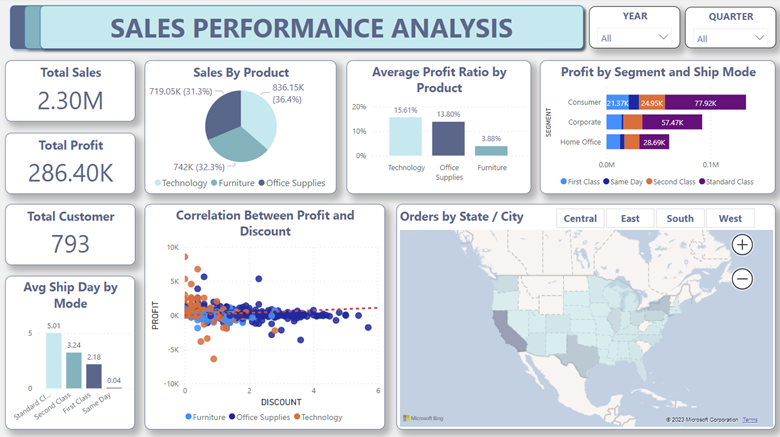

<h1 align="center">
  Sales Performance
</h1>

**Project Description**: 
Our goal is to distill actionable insights from the historical dataset, shedding light on patterns, trends and relationships within the data. By leveraging the power
of data analysis, we aim to provide valuable business intelligence and facilitate informed decision-making, allowing key stakeholders to better understand their
business. By conducting a methodical investigation of this data, we aim to uncover significant discoveries that help propel strategic plans and improve overall
operational effectiveness.

<h4 align="center">The project is made by Phuc An Nguyen</h4>

## Key Features

Problem-solving:
* Descriptive analysis: Total Sales, Total Profit, Total Customer, Top 5 customers by sales, Top 5 products by profit and top 5 customers by orders.
* Average delivery date for each type of ship mode.
* Sales by product category, detail percentage saling by subcategory.
* Average profit ratio by product, trending sales by date.
* Profit by segment and ship mode.
* Correlation between profit and discount, detail information for each consumer.
* Total orders by state and city.

Data Visualization: Slicer, Card, Bar chart, Pie chart, Donut chart, Line chart, Stacked bar chart, Scatter Plot, Filled map, Treemap.

Decision Making:
* Discussion: address any limitations or constraints
* Recommendation: provides specific, actionable recommendations based on the analysis or that can be applied to the future.

## How to Install and Run the Project
Run `Synogize.pbix` file with `Power BI Desktop`

## Credits
This software uses the following open source packages:

- [DAX](https://learn.microsoft.com/en-us/dax/)
- [PowerBI Desktop](https://powerbi.microsoft.com/en-us/downloads/)

